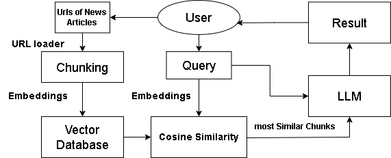
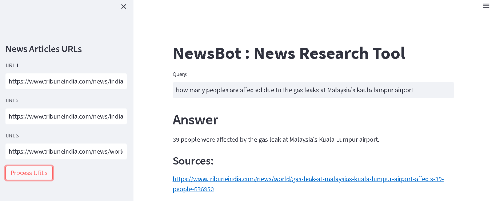

# InfoSnatch | News Research Tool

## Overview
InfoSnatch is an AI-powered RAG designed to provide accurate answers to questions based on news articles. It makes navigating and extracting information from news articles effortless and intuitive.

## Features
Upload URLs of news articles
Ask questions and receive precise answers derived from the articles
Efficient chunking and vector storage for semantic search
User-friendly interface

## How It Works
Input URLs: Users provide URLs of news articles.

Chunking: The articles are split into manageable sections (chunks).

Vector Database: Each chunk is converted into a vector and stored using FAISS, capturing the semantic meaning.

Query Input: Users input their questions.

Cosine Similarity: The user's query is matched with the most relevant chunks using cosine similarity.

LLM Integration: GPT-3.5-turbo processes the matched chunks to generate an accurate and relevant response.

Output Result: Users receive concise and relevant answers based on the news articles.

## Tech Stack
Python: Core programming language.

LangChain: For efficient data preprocessing and integration.

OpenAI API (GPT-3.5-turbo): Powers the question-answering capability.

FAISS: Used for vector storage to enable fast and accurate semantic search.

Streamlit: Used to build a user-friendly interface.

